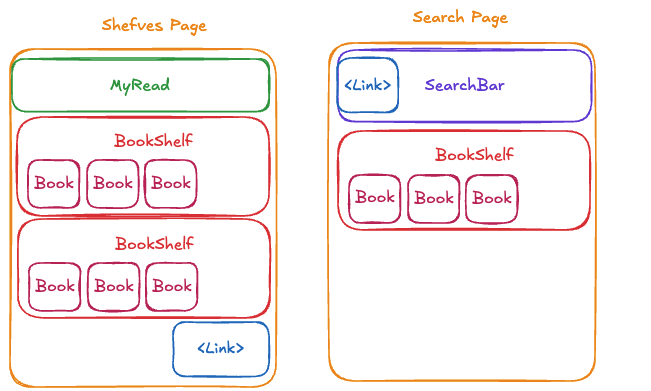

# MyReads Project

So this is the myRead project from Udacity course on react fundamentals.

## How to run the project

1. Install all project dependencies with `npm install`
2. Start the development server with `NODE_OPTIONS=--openssl-legacy-provider npm start`

But you can also run the project with docker:

1. `docker compose up`

Then open the browser and go to `http://localhost:3000`

## Global architecture

Here are a global architecture of the project in term of components.

## Main components

The main components are:

- `BookShelf` - a component that allows to view books in a shelf and edit their shelf.
- `Book` - a component that displays a book with an image, title, authors and shelf.
- `SearchBar` - a component that allows to search for books.

Pages (components but with their own routing with react-router):

- `PageSearch` - a component that allows to search for books and add them to the shelf.
- `PageShelf` - a component that displays all books and allows to edit their shelf.

## Data flow

Basicly, the data is imported from the BooksAPI. Each time the page is loaded, the data is fetched from the BooksAPI and stored in the local state.
We use the `useEffect` hook to fetch the data from the BooksAPI as shown in the udacity course. I wonder how we could avoid this little moment of delay when the page is loaded and we don't have the data yet.

When the user changes the shelf of a book, the change is saved to the BooksAPI and the local state is updated.

For the search page, the data is fetched from the BooksAPI only when the user starts typing in the search bar.

## Warnings

The code is actually running but running the npm start give several warnings in the console due to deprecated methods.

Also running npm start was not working due to an openssl error. I had to run `NODE_OPTIONS=--openssl-legacy-provider npm start` to make it work.

## Erratum

I did understand at the end of the project that my github commit messages did not comply with the udacity requirements (type: Subject for commit messages), sry ...