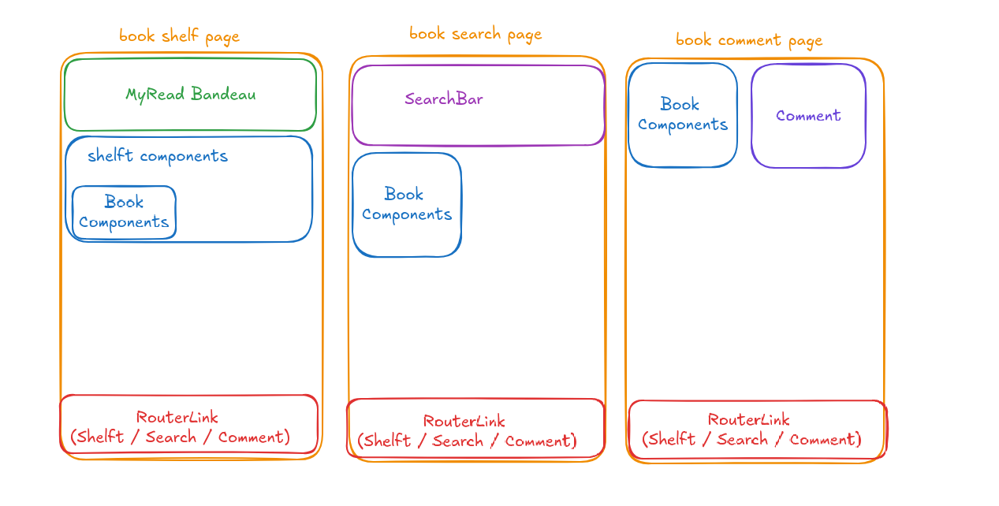
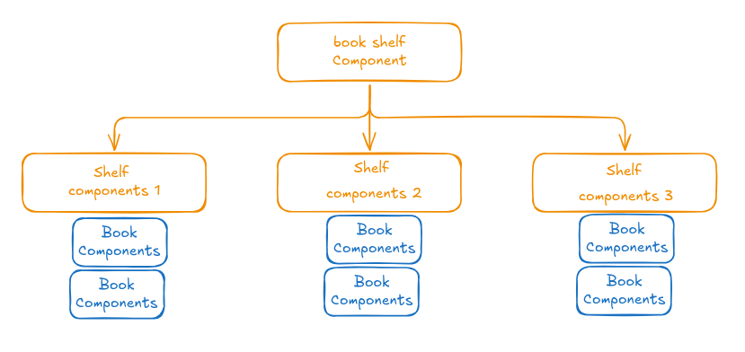
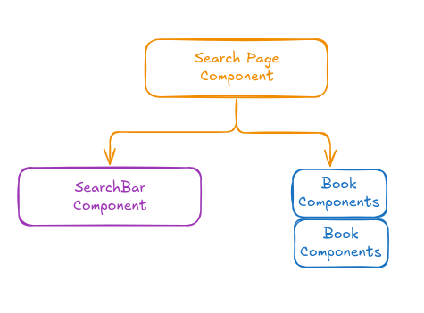

## MyRead project setup

#### Global architecture

We choose to have 3 routes / pages :

- shelves page with all the information about book to read / reading / already read

- search page where we can look at all the books and add them in the shelves

- (optional) comment page where we can comment all our book that are already read

Here is the global setup :

For the book shelf hierarchy we will have : 

And for the search page :

#### Data the differents components needed

